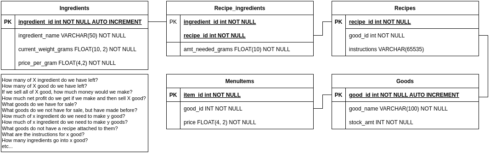

This is about as simple as I could make it. You will need to have your OpenAI key set as an environment variable, and the database connection set as the following:
```python
conn_params = {
    "user" : "test",
    "password" : "test",
    "host" : "test",
    "database" : "test"
}
```
The database is an inventory manager of sorts. It keeps track of good and ingredients, along with what goods need x ingredients, the price of the ingredients, and the sell price of the goods. The database that I am using is MariaDB, an open-source branch of mySQL.
The database has this structure from my ERD diagram:



you give it a question and it gives out a response, like these following examples.

### question 1
what question do you have about the bakery inventory?

Which menu items cost more than $8.00?

llm sql:
```SQL
SELECT good_name, price
FROM MenuItems
JOIN Goods ON MenuItems.good_id = Goods.good_id
WHERE price > 8.00;
```

database response:  [('Chicken Caesar Salad', 8.49), ('Beef Burrito', 8.75)]

llm response: **The Chicken Caesar Salad and Beef Burrito each cost more than $8.00.**

Very simple question, got the answer spot on!
### question 2
what question do you have about the bakery inventory?

what would be the net profit if I were to sell 20 beef burritos?

llm sql:
```SQL
SELECT SUM(amt_needed_grams * price_per_gram) AS total_cost_per_burrito
FROM Recipe_Ingredients
JOIN Ingredients USING (ingredient_id)
WHERE recipe_id = (
  SELECT recipe_id FROM Recipes WHERE good_id = (
    SELECT good_id FROM Goods WHERE good_name = 'Beef Burrito'
  )
);
```
database response: [(9.9,)]

llm response: **Each Beef Burrito costs $9.90 in ingredients. At a sale price of $8.75, selling 20 would result in a net profit of -23.00, meaning a loss.**

This question did not have a good query result, as it was just [(9.9,)]. I changed the instructions to not do it's own math and just use the database because of this question.

After running these questions, I saw that it was trying to do both its own math to answer things, and then it was also not remembering what the question was originally. I changed this so it would be also fed in the original question along with the database result, and edited the instruction_prompt.txt to both reflect that and to not do math anymore. You can see the changes between the two from instruction_prompt_original.txt and instruction_prompt.txt. This prompt change caused the answers to give to make a lot more sense, and made it so the SQL did the math instead of the LLM.

Some other changes I made to the instruction_prompt.txt was simplifying the information I sent over to it (aka not including what is in the database, just the database structure) and adding in a line to give out just raw SQL strings, as it tried to do MarkDown formatting on one of them and crashed the program. **If I were doing this right, I would be serializing the SQL it gives back, but I'm not. If it crashes because the bot does something weird, so be it.**

OTHER QUESTION EXAMPLES:
### question 1
what question do you have about the bakery inventory?

Which menu item has the highest ingredient cost per portion, and what is the cost difference between its sale price and ingredient cost?

llm sql:  
```SQL
SELECT mi.item_id, g.good_name, mi.price, SUM(ri.amt_needed_grams * i.price_per_gram) AS ingredient_cost, mi.price - SUM(ri.amt_needed_grams * i.price_per_gram) AS price_difference
FROM MenuItems mi
JOIN Goods g ON mi.good_id = g.good_id
JOIN Recipes r ON g.good_id = r.good_id
JOIN Recipe_Ingredients ri ON r.recipe_id = ri.recipe_id
JOIN Ingredients i ON ri.ingredient_id = i.ingredient_id
GROUP BY mi.item_id
ORDER BY ingredient_cost DESC
LIMIT 1;
```

database response:  [(5, 'Beef Burrito', 8.75, 9.9, -1.15)]

llm response:  **The Beef Burrito has the highest ingredient cost per portion at $9.90. Its sale price is $8.75, making the cost difference -$1.15, meaning it sells for less than its ingredient cost.**
### question 2
what question do you have about the bakery inventory?

What ingredients are used in the Veggie Wrap?

llm sql:  
```SQL
SELECT ingredient_name 
FROM Ingredients 
JOIN Recipe_Ingredients ON Ingredients.ingredient_id = Recipe_Ingredients.ingredient_id 
JOIN Recipes ON Recipe_Ingredients.recipe_id = Recipes.recipe_id 
WHERE Recipes.good_id = 2;
```

database response:  [('Lettuce',), ('Tomato',), ('Flour Tortilla',), ('Black Beans',)]

llm response:  **The ingredients used in the Veggie Wrap are lettuce, tomato, flour tortilla, and black beans.**
### question 3
what question do you have about the bakery inventory?

If I sold 10 of each menu item, which ingredient would be depleted the most in total grams?

llm sql:  
```SQL
SELECT i.ingredient_name, SUM(ri.amt_needed_grams * 10) AS total_grams_used
FROM Recipe_Ingredients ri
JOIN Ingredients i ON ri.ingredient_id = i.ingredient_id
GROUP BY i.ingredient_name
ORDER BY total_grams_used DESC
LIMIT 1;
```

database response:  [('Ground Beef', 2700.0)]

llm response:  **If you sold 10 of each menu item, Ground Beef would be depleted the most, using 2700 grams.**
### question 4
what question do you have about the bakery inventory?

Which ingredient contributes the most to the cost of the Spicy Tofu Bowl?

llm sql:  
```SQL
SELECT i.ingredient_name, (ri.amt_needed_grams * i.price_per_gram) AS cost_contribution
FROM Recipes r
JOIN Recipe_Ingredients ri ON r.recipe_id = ri.recipe_id
JOIN Ingredients i ON ri.ingredient_id = i.ingredient_id
WHERE r.good_id = 4
ORDER BY cost_contribution DESC
LIMIT 1;
```

database response:  [('Tofu', 5.0)]

llm response:  **The ingredient that contributes the most to the cost of the Spicy Tofu Bowl is Tofu, accounting for $5.00.**
### question 5
what question do you have about the bakery inventory?

Which menu item uses the most total grams of ingredients?

llm sql:
```SQL
SELECT MenuItems.item_id, Goods.good_name, SUM(Recipe_Ingredients.amt_needed_grams) AS total_grams
FROM MenuItems
JOIN Goods ON MenuItems.good_id = Goods.good_id
JOIN Recipes ON Goods.good_id = Recipes.good_id
JOIN Recipe_Ingredients ON Recipes.recipe_id = Recipe_Ingredients.recipe_id
GROUP BY MenuItems.item_id, Goods.good_name
ORDER BY total_grams DESC
LIMIT 1;
```

database response:  [(5, 'Beef Burrito', 350.0)]

llm response:  **The Beef Burrito uses the most total grams of ingredients, with 350 grams.**
### question 6
what question do you have about the bakery inventory?

What should I be selling the Beef Burrito at if I want to make a 20% profit?

llm sql:  
```SQL
SELECT ROUND(SUM(ri.amt_needed_grams * i.price_per_gram) * 1.2, 2) AS suggested_price
FROM Recipe_Ingredients ri
JOIN Ingredients i ON ri.ingredient_id = i.ingredient_id
JOIN Recipes r ON ri.recipe_id = r.recipe_id
WHERE r.good_id = 5;
```

database response:  [(11.88,)]

llm response:  **To make a 20% profit, you should sell the Beef Burrito at $11.88.**
